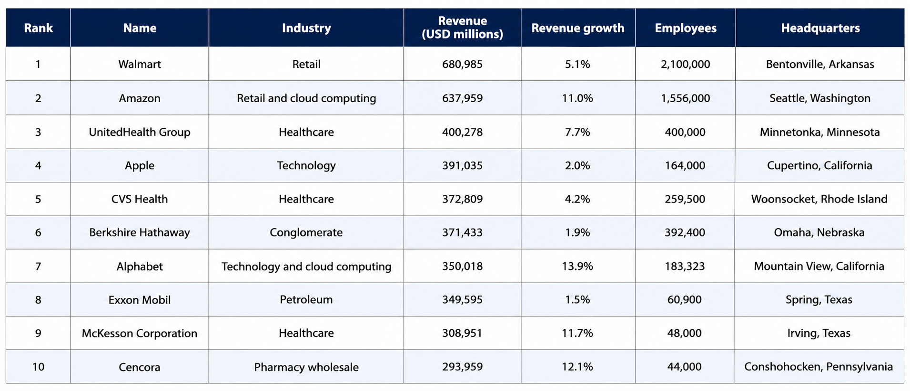

🌐 Web Scraping a Real Website to Build a Structured Dataset of the Largest U.S. Companies Using BeautifulSoup & Pandas

A Python web scraping project that extracts the List of Largest Companies in the United States by Revenue from Wikipedia using BeautifulSoup, cleans the data with Pandas, and exports it as a structured CSV dataset.

  

  
  
  
  
  

---

📌 Project Overview

This project demonstrates an end-to-end web scraping workflow.

✔️ Send HTTP requests to a real website

✔️ Parse HTML using BeautifulSoup

✔️ Extract structured table data

✔️ Clean and transform the extracted data

✔️ Store the data inside a Pandas DataFrame

✔️ Export the final dataset as a CSV file

---

🛠️ Technologies Used

- 🐍 Python
- 🌐 Requests
- 🍲 BeautifulSoup (bs4)
- 🐼 Pandas
- 📓 Jupyter Notebook

---

📂 Project Structure

PYTHON_DATA_ANALYSIS/
│
├── Beautifulsoup_and_requests.ipynb
├── find_and_find_all.ipynb
├── Scraping_from_real_website.ipynb
├── Companies.csv
├── assets/
│   └── companies_preview.png
└── README.md

---

📖 What I Learned

During this project I learned how to:

- ✅ Send HTTP requests using Requests
- ✅ Parse HTML using BeautifulSoup
- ✅ Understand the difference between "find()" and "find_all()"
- ✅ Extract HTML tables from real websites
- ✅ Clean scraped text using Python
- ✅ Use list comprehensions effectively
- ✅ Build a Pandas DataFrame
- ✅ Export data to CSV
- ✅ Handle User-Agent headers for web scraping

---

📊 Dataset

The generated dataset contains:

Column
🏆 Rank
🏢 Company Name
🏭 Industry
💰 Revenue (USD Millions)
📈 Revenue Growth
👨‍💼 Employees
📍 Headquarters

---

📈 Skills Demonstrated

- 🌐 Web Scraping
- 🧹 Data Cleaning
- 📊 Data Analysis
- 🍲 HTML Parsing
- 🐍 Python Programming
- 🐼 Pandas
- 📁 CSV File Handling

---

⭐ If you found this project helpful, consider giving it a Star!
